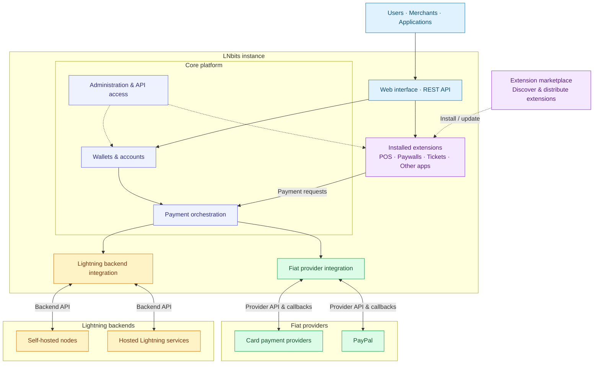

## LNbits Architecture Overview

LNbits connects Lightning backends and fiat payment providers to a shared platform for wallets, payments, and extensions. The diagram below shows three parts of that architecture:

- Backends and providers supply the external payment services on the left.
- The LNbits instance contains the application layer, core platform, and payment integrations in the center.
- Users, merchants, and applications access LNbits through its web interface and REST API, while the extension marketplace provides extensions to install and update on the right.

This is a **conceptual** overview: the connections summarize integration and access paths, rather than individual payment flows or internal implementation details.

