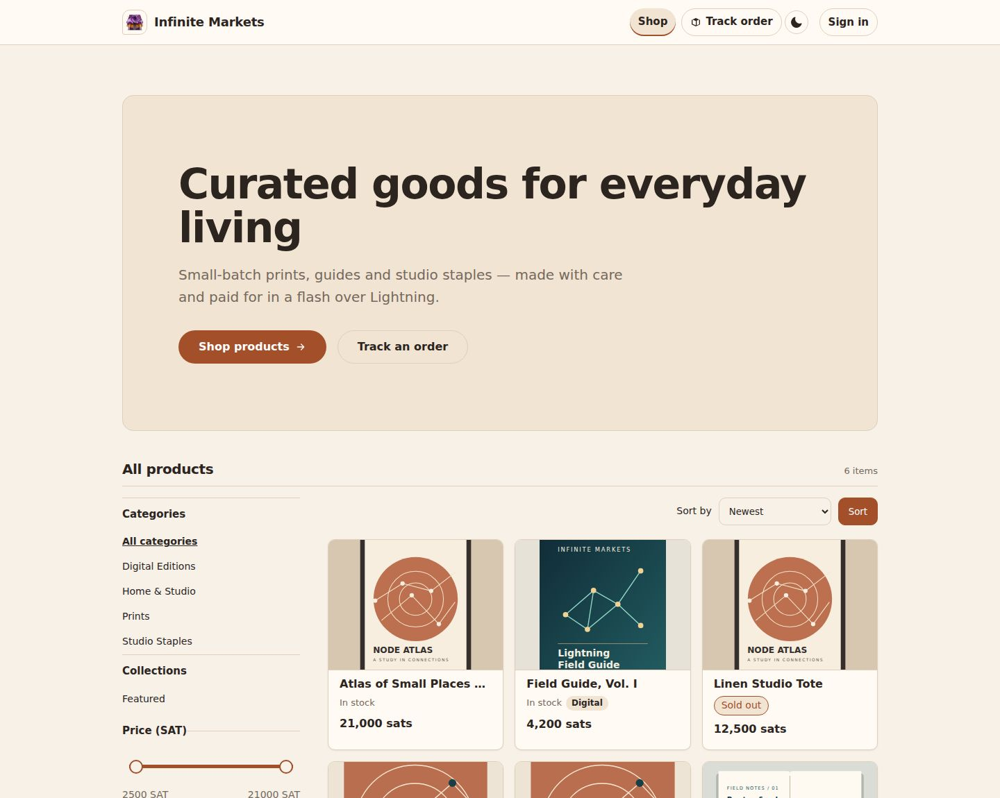
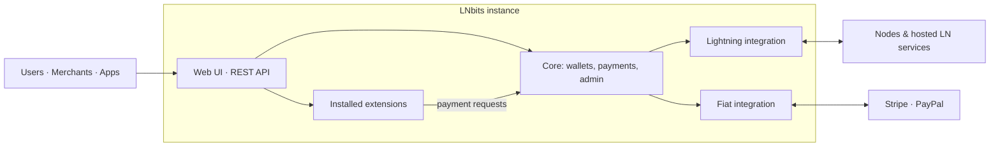
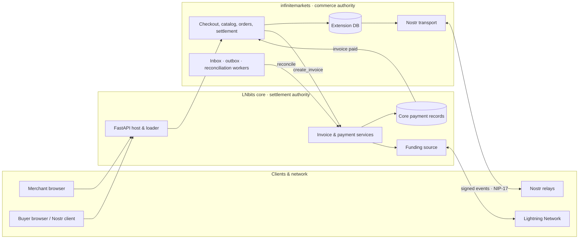
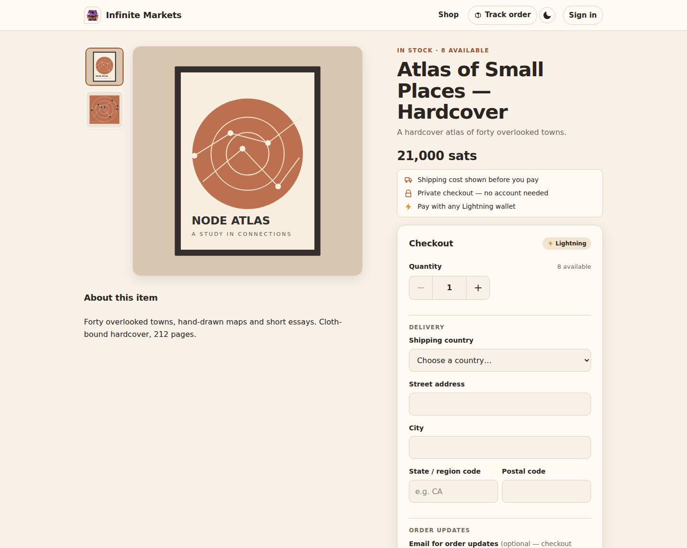
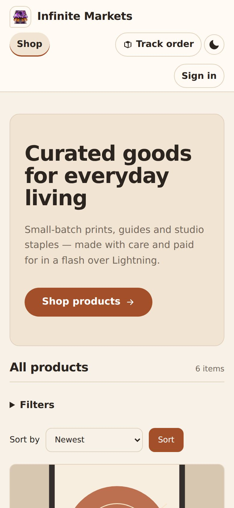
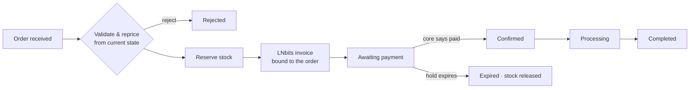
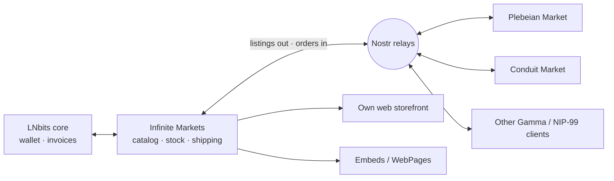

<!--
One-page illustrated overview of Infinite Markets, rendered by overview.html
(also readable directly on GitHub). Source material: slides/deck.md.
Images live in img/; fenced mermaid blocks render as diagrams.
-->

# Infinite Markets: an illustrated overview

**One inventory. Every storefront. Your rails.** Infinite Markets is an
open-source (MIT) extension for [LNbits](https://github.com/lnbits/lnbits). It
runs a merchant's catalog, stock, shipping, Lightning checkout, and customer
messages inside their own LNbits instance, then publishes that catalog to the
open Nostr network so it can be sold through the merchant's own web shop and
through Nostr marketplaces such as Plebeian Market and Conduit Market.

| | |
|---|---|
| **What** | A standard Python LNbits extension (`infinitemarkets`), v0.5 |
| **Requires** | LNbits ≥ 1.6.0 and a bound merchant wallet |
| **Sells through** | Its own web storefront, embeds, and Gamma / NIP-99 Nostr marketplaces |
| **Payments** | Lightning invoices from the merchant's LNbits wallet |
| **License** | MIT, by bitkarrot |

## 1. LNbits in sixty seconds

LNbits is a **free, open-source Lightning wallet and accounts system**, in
development since 2018. It sits on top of a Lightning funding source and splits
it into many isolated wallets, each with its own balance and keys. **Admin
keys** can spend; **invoice keys** can only receive, so apps can create invoices
without ever holding spending power.

- **Bring your own backend:** self-hosted nodes (LND, Core Lightning, Eclair, Phoenixd), hosted services (Alby, Strike, Blink, OpenNode, ZBD), or advanced options (Nostr Wallet Connect, Breez SDK, Spark L2, Boltz). Stripe and PayPal cover card payments.
- **Switch backends freely:** wallet balances are tracked by LNbits, so moving from a hosted service to your own node doesn't change anything for the apps on top.
- **Extensions are real apps:** Python extensions get their own routes, database migrations, UI, and permanent background tasks, and core notifies them when their invoices are paid.
- **Runs anywhere:** a Raspberry Pi, a VPS, node platforms, or hosted SaaS at my.lnbits.com.

LNbits already offers a **Merchant Stack** for in-person and simple online
sales: TPoS (point of sale), Inventory (shared stock), Orders (receipts and
notifications), WebShop, Tabs (deferred settlement), and SaaS hosting.
Infinite Markets adds what was missing: **Nostr-native, multi-marketplace
commerce with a production-grade checkout.**

## 2. The problem

Selling for bitcoin on Nostr is possible today, but it's fragile:

| Pain | What it looks like |
|---|---|
| **Fragmented catalogs** | The web shop and every marketplace keep their own copy; stock drifts and merchants oversell |
| **"Was it paid?"** | Nostr receipts and buyer-stated amounts aren't proof; retries create duplicate invoices |
| **Browser-bound shops** | Orders wait until the merchant's tab or signer is online |
| **Unreliable relays** | Publishing isn't delivery; deleted items linger; nothing records who accepted what |
| **Legacy protocol** | NIP-15 is unrecommended; NIP-04 messages leak who buys from whom |
| **Platform lock-in** | Marketplaces can end up owning the funds and the customer relationship |

The ecosystem's answer at the protocol level is **NIP-99 listings plus the
Gamma Markets spec**, written by the teams behind Shopstr, Cypher, Plebeian
Market and Conduit Market. It adds collections, shipping options, encrypted
NIP-17 orders, payment requests and receipts. Infinite Markets implements that
spec on the merchant's own infrastructure.

## 3. What Infinite Markets is

Infinite Markets is the **commerce authority**: it owns the catalog,
inventory, shipping, orders, messages, and publication. **LNbits core stays
the settlement authority**: it creates invoices, records payments, and talks to
the funding source. Two sales rails, a web storefront and a native Nostr
channel, share **one pricing, reservation, invoicing and settlement pipeline**.

> No duplicate invoices. No double allocation. Relay delivery is never mistaken for payment truth.

Five design principles hold the system together:

1. **Domain before protocol:** products and orders are commerce records; Nostr events are projections of them.
2. **One writer per catalog:** one extension owns stock and invoice creation.
3. **Payment truth comes from LNbits**, never from relays or receipts.
4. **Relays are eventually consistent transport:** an outbox, per-relay acknowledgement evidence, and retries.
5. **Compatibility is testable:** proven against real marketplace clients, not just matching event numbers.

The extension never writes LNbits' payment tables and never calls
outgoing-payment APIs. The [architecture diagrams](architecture.html) show the
full numbered flow.

## 4. Two rails, one pipeline

### Rail 1: the web storefront

Shoppers browse categories and collections, filter by price, and pay with
any Lightning wallet, with no account needed. They can sign in with Nostr
(NIP-07) or an email magic link to see their order history. Merchants pick
from theme presets and four layouts, set their brand, and fine-tune colors
behind WCAG contrast checks.

Four **storefront modes** control how the shop sells: `full` (web and Nostr),
`showcase` (web visitors are guided to order via Nostr), `browse_only`, and
`nostr_only`. Private order links and in-flight invoices keep working in every
mode.

### Rail 2: native Nostr commerce

The merchant's catalog is published as signed Nostr events:

| Kind | Direction | Purpose |
|---|---|---|
| `30402` | out | NIP-99 product listing (price, stock, images, specs) |
| `30405` / `30406` | out | Collections / shipping options |
| `0` | out | Merchant profile (name, bio, NIP-05, Lightning address) |
| `10050` | out | Inbox relays: where buyers send orders |
| `31989` / `31990` | out | NIP-89 handler: lets clients deep-link to the merchant's pages |
| `1059` | in & out | NIP-17 gift-wrapped orders, payment requests, status updates |
| `5` | out | Deletion requests for removed items |

Orders, invoices and buyer data are never published.

### The checkout saga

Every order, from either rail, goes through the same steps:

- Stock is held for **15 minutes** by default and consumed exactly once when payment settles.
- If invoice creation is uncertain, it is **never blindly retried**; a reconciliation worker asks LNbits for the exact invoice instead.
- Payments that arrive late are flagged for an explicit merchant decision, never silently re-opened.

## 5. Running the shop

The admin panel is a full back office, and background workers keep the shop
running when the merchant's browser is closed: publishing, relay management,
reservation expiry, payment reconciliation, email, and data retention.

")

**Relays you can audit.** Every catalog change becomes a durable outbox entry.
A worker rebuilds the event from current data, signs it, and records each
relay's accept, reject, or timeout. The **relay catalog check** compares what
relays actually serve against the catalog and can re-request deletion of stale
copies.

**Bring your catalog.** Import a Shopify CSV, the native CSV format, a
`nostrmarket` JSON export, or signed NIP-15 events. Everything lands as
**hidden drafts** to review before publishing, and the catalog can be exported
again as CSV.

**Embed anywhere.** Two lines of code drop product cards into any web page,
including pages built with the LNbits WebPages extension, with no iframe
needed. A modal mode keeps shoppers on the page; checkout always lands on the
merchant's hosted pages.

**Secure by construction.** The extension never spends: paid-relay invoices are
shown to the merchant, not paid. Merchant keys, buyer identifiers, and order
messages are encrypted at rest; private-key export is explicit and owner-only;
relay connections are screened against private and metadata IP ranges; and
checkout is rate-limited.

## 6. Publish everywhere, own your rails

Because the catalog is published as standard NIP-99 / Gamma events signed
with the merchant's own key, any compatible marketplace reading those relays
can show it. Buyers check out in the marketplace they already use; the order
arrives as an encrypted NIP-17 message in the merchant's own inbox and enters
the **same reservation and invoice pipeline** as a web order.

> The marketplace is a view. The merchant's LNbits is the source of truth.

What never leaves the merchant:

| Rail | Where it lives | Why it matters |
|---|---|---|
| **Inventory** | The extension database: on-hand and reserved stock per product and variant | One stock count across every channel, no overselling |
| **Shipping** | Merchant-defined options, country zones and weight/volume rules, published as kind 30406 | Marketplaces quote the merchant's rules, not their own |
| **Payments** | The merchant's LNbits wallet on their chosen funding source | No marketplace custody, no middleman fees |
| **Customers** | Encrypted NIP-17 threads and email in the merchant's admin | No platform owns the relationship |
| **Identity** | The merchant's Nostr key, encrypted at rest | Portable across every Nostr app |

The merchant profile tells marketplaces that payment is handled manually, so
they wait for the merchant's own payment request. The marketplace never
creates the invoice; the merchant's LNbits does, bound to the order.

### Plebeian Market: proven interop

- A scripted test suite drives a pinned copy of the Plebeian Market code through checkout, encrypted order intake, invoicing and settlement: **14 of 14 checks pass** [tested]
- On **plebeian.market** itself (October 9), the merchant profile and listings render with images, sat prices and stock [tested]
- A live checkout and order on plebeian.market hasn't been run yet [todo]
- Known gap: physical orders with free-text addresses are rejected before stock is reserved, with a clear reply to the buyer

### Conduit Market: same open spec

Conduit is a Nostr shopper marketplace with a merchant portal. It co-authored
the Gamma spec and works with the Open Markets Foundation on a shared commerce
spec. It is not the seller, custodian, carrier, or escrow; merchants bring their
own Lightning. Infinite Markets publishes the same listing, collection and
shipping event types and receives orders over NIP-17, so it should work with
Conduit [spec-aligned], but this hasn't been tested yet [todo].

### The LNbits Merchant Stack: today and next

- **Today** [shipped]: payments through LNbits core, email through the host's SMTP settings, embeds through WebPages, and `nostrrelay` as a reference inbox relay. Inventory and shipping are native to Infinite Markets.
- **Next** [roadmap]: use the LNbits **Inventory** extension as a shared stock source across LNbits sales channels, and integrate a **Shipping** extension for shipping rules and fulfillment.

## 7. Status, risks and what's next

**Where it stands.** Releases A, B, 03.1 and C are implemented: web commerce,
Gamma NIP-17 orders, buyer accounts, and catalog import/export. Version 0.5 is
published through an LNbits extension manifest with a sha256-verified archive.
Conformance testing covers a gated relay environment, egress / relay-auth /
paid-relay drills, the Plebeian test suite, and a live plebeian.market listing
check. Escrow, fiat custody, automated refunds, subscriptions and reviews are
out of scope for v1.

**Risks.**

1. **This is experimental software:** v0.5, built on a draft marketplace spec. Start with small amounts.
2. **It depends on community support and feedback:** interop relies on marketplace clients, the spec working group, and real merchants using it.
3. **Maintenance has a cost:** keeping up with LNbits releases, spec revisions, marketplace changes, and security updates takes ongoing time and resources.

**What's next.**

- **Seeking testers and active users:** run the extension, validate it, send feedback, and [file issues](https://github.com/bitkarrot/infinitemarkets/issues).
- Run a live checkout and order on plebeian.market.
- Add Conduit Market (and Shopstr) to the external-client test suite.
- Structured addresses so marketplace physical orders work end to end.
- Integrate the LNbits Inventory and Shipping extensions.
- Follow the Open Markets Protocol as the Gamma draft evolves.

## Get started

1. In LNbits, open **Server → Extensions → Manifest sources** and add `https://raw.githubusercontent.com/bitkarrot/infinitemarkets/main/manifest.json`
2. Set four host environment variables: `INFINITEMARKETS_MASTER_KEYS`, `INFINITEMARKETS_ACTIVE_KEY_VERSION`, `INFINITEMARKETS_PRIVACY_KEY`, and `INFINITEMARKETS_PUBLIC_BASE_URL` (see the [README](https://github.com/bitkarrot/infinitemarkets#configuration))
3. Bind a merchant wallet and publish your first product

**More:** [source code and issues](https://github.com/bitkarrot/infinitemarkets) · [slide deck](slides.html) · [architecture diagrams](architecture.html) · [demo video](https://github.com/bitkarrot/infinitemarkets/blob/main/docs/assets/infinitemarkets_demo.mp4)
