<!--
Deck source for the infinitemarkets slideshow, rendered by ../slides.html
(assets/slides.js + assets/slides.css on top of assets/style.css).

Authoring conventions
- Slides are separated by a line containing only three dashes.
- A slide's first line may be an HTML comment starting with "slide:" that sets
  layout=title|bullets|split|diagram|table|gallery|cta,
  accent=lime|yellow|orange|pink|mint|blue (viewer palette tokens), and
  kicker="..." (the mono pill above the headline), bg=night (deep purple
  background that suits the logo) and logo=<path> (logo on the right).
- split: content groups (a bold-only line starts a group) or text + image
  become two columns. Blockquotes always render full width at the bottom.
- Images: , paths relative to this file.
- A line containing only "Note:" starts speaker notes (press N in the deck).
- Fenced mermaid blocks render as diagrams in the slide's accent color.
- Status tags in bullets render as chips: [shipped] [tested] [spec-aligned] [todo] [roadmap].
-->

<!-- slide: layout=title accent=yellow bg=night logo=../img/logo-512.png kicker="infinitemarkets · v0.5 · LNbits extension" -->
# Infinite Markets

## One inventory. Every storefront. Your rails.

A Lightning-settled commerce engine for LNbits. Sell on your own web shop
and on Nostr marketplaces like Plebeian Market and Conduit Market,
without giving up inventory, shipping, or payments.

Note:
Frame the talk in one sentence: the merchant keeps the shop's brain (catalog,
stock, shipping, invoices, customer messages) inside their own LNbits instance,
and every storefront, theirs or a marketplace's, is just a window onto it.

---

<!-- slide: layout=split accent=orange kicker="part 1 · lnbits" -->
# What is LNbits?

- **Free, open-source (MIT)** Lightning wallet & accounts system, in development since 2018
- Sits **on top of any Lightning funding source** and splits it into many isolated wallets
- **REST API** for invoices & payments; **admin keys** spend, **invoice keys** only receive
- Accounts via email, username, or **Nostr pubkey**
- Runs on a Pi, a VPS, node platforms, or **hosted SaaS** (my.lnbits.com)

**Bring your own backend**
- **Nodes:** LND, Core Lightning, Eclair, Phoenixd
- **Services:** Alby, Strike, Blink, OpenNode, ZBD
- **Advanced:** NWC, Breez SDK, Spark L2, Boltz
- **Fiat:** Stripe, PayPal

Note:
LNbits is a layer of abstraction between users and the node. One node serves
many users; each wallet tracks its own balance and keys; switching the funding
source doesn't touch user balances. A merchant can start on a hosted service or
NWC and move to their own node later; Infinite Markets doesn't change, it only
asks LNbits core to create invoices on the merchant's bound wallet, never
holding spend keys.

---

<!-- slide: layout=diagram accent=orange kicker="part 1 · lnbits" -->
# An extension platform, not just a wallet

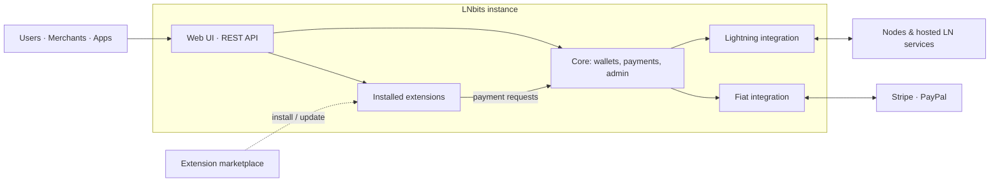

- Python extensions get **their own routes, DB migrations, UI, and background tasks**
- Core dispatches **invoice-paid events** to the extension that created the invoice
- Installed from **manifest sources** with sha256-verified archives

Note:
Source: docs/lnbits_architecture_overview.md (conceptual, not a payment-flow
diagram). Background tasks matter: they keep the shop running while the
merchant's browser is closed.

---

<!-- slide: layout=table accent=orange kicker="part 1 · lnbits merchant stack" -->
# The LNbits Merchant Stack

| Piece | Role |
|---|---|
| **TPoS** | In-person checkout |
| **Inventory** | Shared products & stock across extensions |
| **Orders** | Receipts, order history, notifications |
| **WebShop** | Simple online sales |
| **Tabs** | Open balances, deferred settlement |
| **SaaS** | Hosted LNbits instance, no server to run |

> Infinite Markets adds what's missing: **Nostr-native, multi-marketplace
> commerce** with a production-grade checkout.

Note:
Infinite Markets is not integrated with these extensions today; see the
"Plugging into the Merchant Stack" slide for what's shipped versus roadmap.

---

<!-- slide: layout=table accent=pink kicker="part 2 · the pain" -->
# The pain, in one slide

| Pain | What it looks like |
|---|---|
| **Fragmented catalogs** | Web shop + every marketplace keeps its own copy; stock drifts, merchants oversell |
| **"Was it paid?"** | Nostr receipts and buyer-stated amounts aren't proof; retries create duplicate invoices |
| **Browser-bound shops** | Orders wait until the merchant's tab or signer is online |
| **Unreliable relays** | Publish ≠ delivered; deleted items linger; no record of who accepted what |
| **Legacy protocol** | NIP-15 is unrecommended; NIP-04 DMs leak who buys from whom |
| **Platform lock-in** | Marketplaces can own the funds and the customer relationship |

Note:
Audience knows this; move quickly. Protocol context if asked: NIP-99 defines
only the listing. The Gamma Markets spec (authored by the Shopstr, Cypher,
Plebeian Market and Conduit teams) adds collections (30405), shipping (30406),
NIP-17 orders, payment requests and receipts. Legacy nostrmarket also
decremented stock after payment with no reservation and modeled orders as
paid/shipped booleans.

---

<!-- slide: layout=split accent=mint kicker="part 3 · infinite markets" -->
# What it is

- A **standard Python LNbits extension**, MIT, v0.5, LNbits ≥ 1.6.0
- **Commerce authority**: catalog, inventory, shipping, orders, messages, publication
- **LNbits core stays settlement authority**: invoices, payment records, funding source
- Two rails, **one pipeline**: a web storefront and a native Nostr/Gamma channel share pricing, reservation, invoicing & settlement

**Design principles**
1. **Domain before protocol**: Nostr events are projections of commerce records
2. **One writer per catalog**: one extension owns stock and invoices
3. **Payment truth comes from LNbits**, never from relays or receipts
4. **Relays are eventually consistent**: outbox, ACK evidence, retries
5. **Compatibility is testable** against real clients

> No duplicate invoices. No double allocation. Relay delivery is never mistaken for payment truth.

---

<!-- slide: layout=diagram accent=mint kicker="part 3 · architecture" -->
# Who owns what

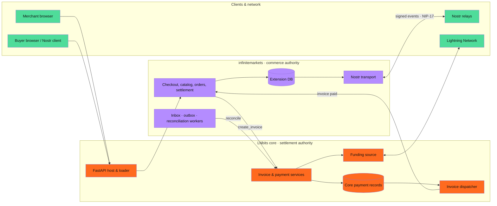

Note:
Full version with numbered flow: viewer diagram 01 (lnbits-integration).
The extension never writes core payment tables and never calls outgoing-payment APIs.

---

<!-- slide: layout=split accent=mint kicker="rail 1 · web" -->
# Rail 1: the web storefront

**For shoppers**
- Category & collection browsing, price filters, sorting
- Lightning checkout with private per-order links
- Sign in with Nostr (NIP-07) or **email magic link**, unified order history
- Dark/light toggle, mobile-first layouts

**For merchants**
- Theme presets, 4 layouts, brand logo/hero/footer, **WCAG contrast gates**
- Email notifications for order events
- 4 storefront modes: `full`, `showcase`, `browse_only`, `nostr_only`

Note:
Modes: showcase turns web checkout into a guided "Order via Nostr";
nostr_only shows a notice on the web and sells only via Nostr. Private order
links and in-flight invoices keep working in every mode.

---

<!-- slide: layout=table accent=mint kicker="rail 2 · nostr" -->
# Rail 2: native Nostr commerce

| Kind | Direction | Purpose |
|---|---|---|
| `30402` | out | NIP-99 product listing (price, stock, images, specs) |
| `30405` / `30406` | out | Collections / shipping options |
| `0` | out | Merchant profile (name, bio, NIP-05, lud16) |
| `10050` | out | Inbox relays (where to send orders) |
| `31989` / `31990` | out | NIP-89 handler: deep-link to merchant pages |
| `1059` | in & out | NIP-17 gift-wrapped orders, payment requests, status |
| `5` | out | Deletion / tombstone |

Note:
Optional NIP-15 projection (30017/30018) exists per category for legacy clients.
Orders, invoices, and buyer data are never exposed publicly. NIP-89 lets
marketplace clients deep-link naddr products to the merchant's own product
page and checkout.

---

<!-- slide: layout=diagram accent=mint kicker="part 3 · checkout saga" -->
# Quote → reserve → invoice → settle

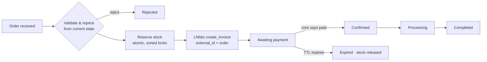

- Reservation hold defaults to **15 min**; stock is consumed exactly once on settlement
- Uncertain invoice creation is **never retried blindly**; reconciliation queries core by exact id
- Late payments are flagged for an explicit merchant decision, never auto-reopened

---

<!-- slide: layout=split accent=mint kicker="part 3 · durable delivery" -->
# Relays you can audit

- Every catalog change becomes a **durable outbox intent**
- Worker rebuilds the event from **current** state, signs it, and records **per-relay ACK / reject / timeout**
- Zero ACKs mean retry with backoff
- **Relay catalog check** classifies live copies: missing / divergent / stale-deleted
- One click **re-requests deletions** for stale copies

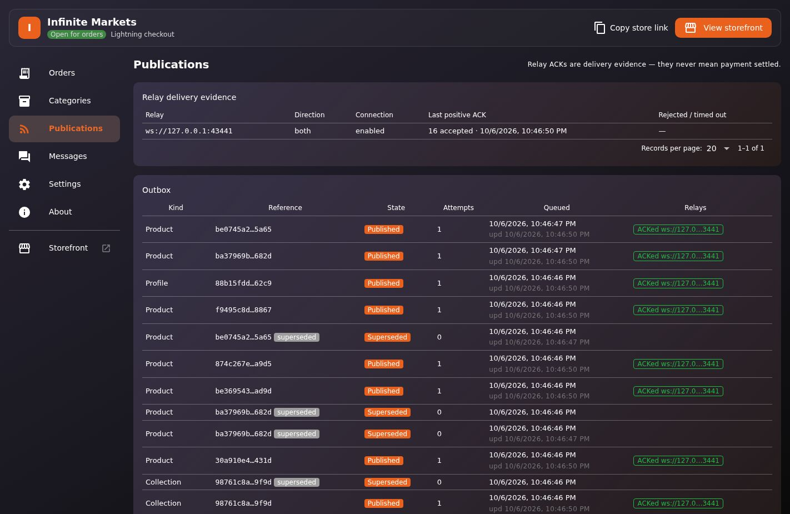

---

<!-- slide: layout=gallery accent=mint kicker="part 3 · merchant operations" -->
# A real back office

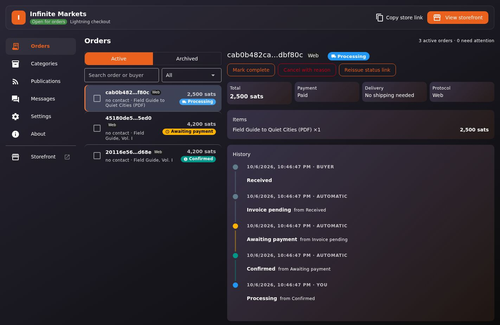
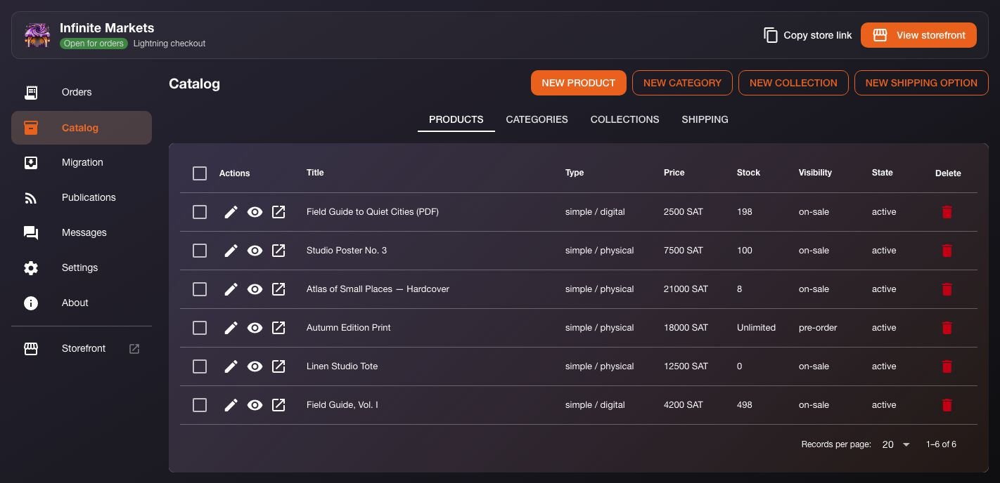
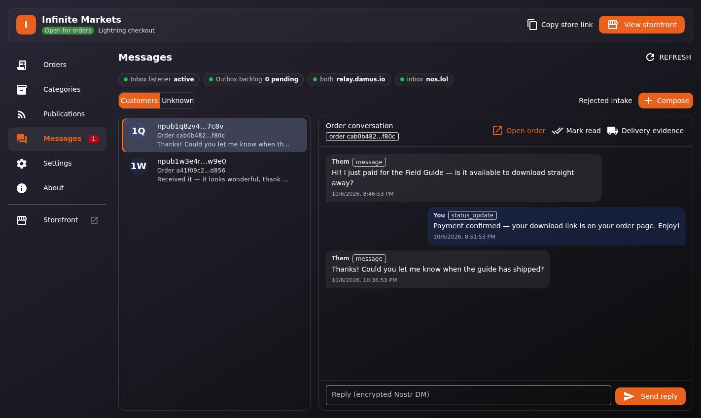

- Background workers keep running with the browser closed: outbox (5 s), relay manager (30 s), reservation expiry (30 s), reconciliation (60 s), email (5 s), retention (24 h)

Note:
Messages screenshot uses a clearly fictional demo conversation (the e2e relay
has no buyer traffic).

---

<!-- slide: layout=gallery accent=mint kicker="part 3 · embed anywhere" -->
# Embed anywhere

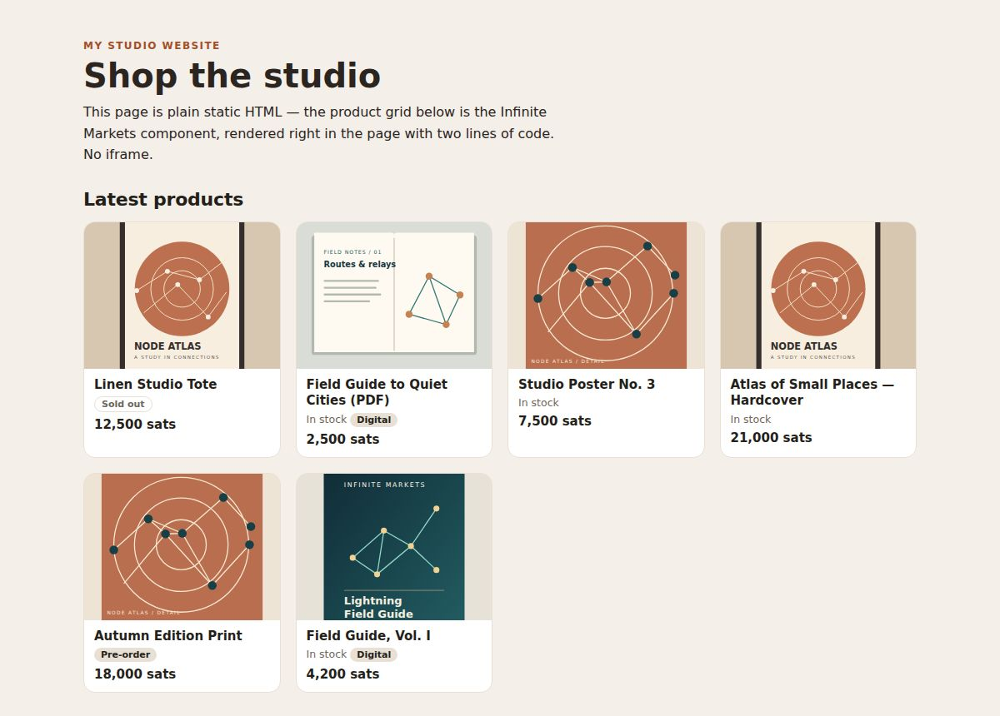
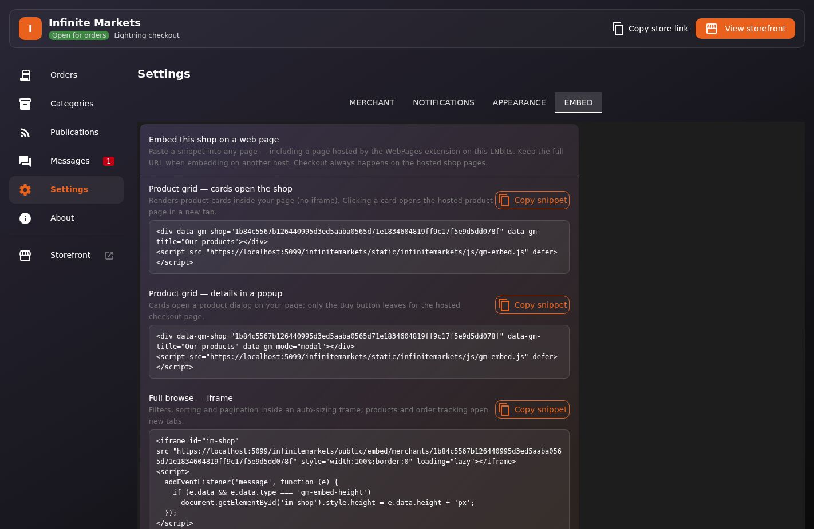

- `gm-embed.js` renders cards in the host page's own DOM; modal mode keeps shoppers on-page
- Chrome-free iframe option with auto-height; works with the LNbits **WebPages** extension
- Checkout always lands on the merchant's hosted pages

---

<!-- slide: layout=split accent=mint kicker="part 3 · bring your catalog" -->
# Bring your catalog

- Import **Shopify CSV**, native CSV, **`nostrmarket` JSON**, or signed **NIP-15** event dumps
- Preview before import; set currency where the file lacks one
- Imports land as **hidden drafts**; review, then publish through the normal Catalog flow
- Round-trippable CSV export; optional media upload & relink

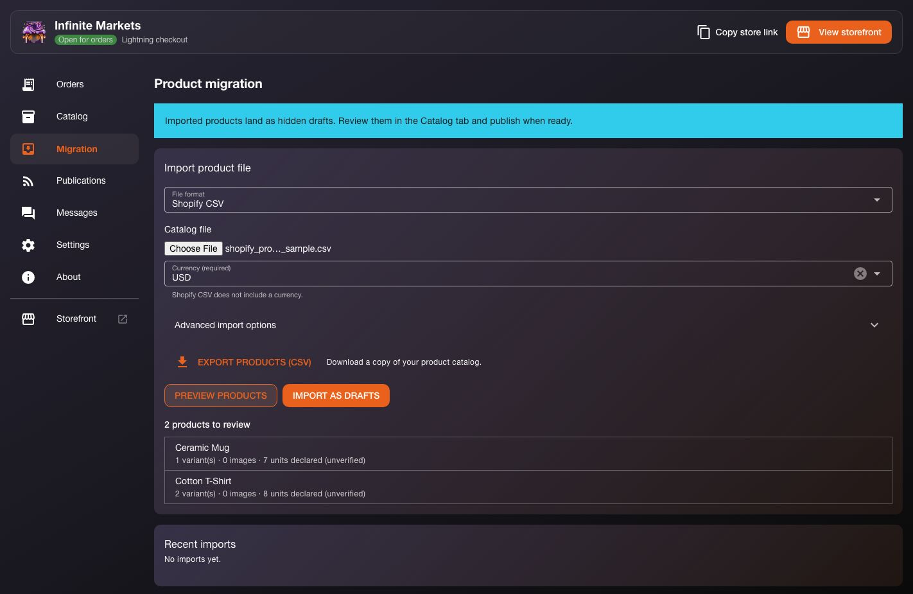

Note:
No cutover or old-order reconciliation. If the old store keeps selling, the
merchant manages overlapping stock before publishing.

---

<!-- slide: layout=bullets accent=mint kicker="part 3 · security & privacy" -->
# Secure by construction

- **Never spends**: no outgoing-payment API calls; paid-relay invoices surfaced, not paid
- Merchant `nsec`, buyer identifiers, NIP-17 payloads, profiles **encrypted at rest**
- Owner-only, explicit private-key reveal/export
- Relay egress screening blocks private / loopback / metadata IP ranges
- NIP-42 relay auth, backoff on churn, per-IP checkout rate limits
- Order tokens live in the URL fragment, never in paths or queries

---

<!-- slide: layout=diagram accent=blue kicker="part 4 · publish everywhere" -->
# Publish once, appear everywhere

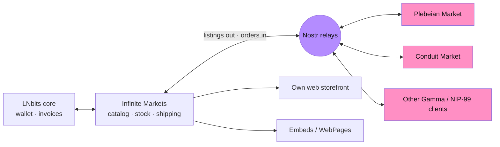

- Standard NIP-99 / Gamma events, signed with the **merchant's own key**
- Buyers check out **in the marketplace they already use**; orders land in the merchant's inbox
- Every order enters the **same reservation & invoice pipeline** as a web order

> The marketplace is a view. The merchant's LNbits is the source of truth.

Note:
End-to-end marketplace order: (1) buyer finds the kind-30402 listing on
Plebeian / Conduit; (2) the marketplace sends a gift-wrapped order to the
merchant's kind-10050 inbox relays; (3) Infinite Markets verifies, dedupes and
reprices from current state; (4) stock is reserved and LNbits creates an
order-bound invoice; (5) a payment request goes back over NIP-17; (6) LNbits
reports settlement, the order is confirmed, status updates follow; (7) the
merchant fulfills from the same Orders workspace as web orders.

---

<!-- slide: layout=table accent=blue kicker="part 4 · own your rails" -->
# What never leaves the merchant

| Rail | Where it lives | Why it matters |
|---|---|---|
| **Inventory** | Extension DB: on-hand + reserved, per product/variant | One stock count across every channel, no oversell |
| **Shipping** | Merchant-defined options, country zones, weight/volume rules, published as 30406 | Marketplaces quote the merchant's rules, not their own |
| **Payments** | LNbits wallet on the merchant's chosen funding source | No marketplace custody, no middleman fees |
| **Customers** | Encrypted NIP-17 threads + email in the merchant's admin | No platform owns the relationship |
| **Identity** | Merchant Nostr key, encrypted at rest | Portable across every Nostr app |

Note:
Kind-0 advertises payment_preference=manual, so Gamma clients wait for the
merchant's own payment request. The marketplace never generates the invoice;
the merchant's LNbits does, bound to the order.

---

<!-- slide: layout=split accent=blue kicker="part 4 · plebeian market" -->
# Plebeian Market: proven interop

- **Scripted matrix** against a pinned `PlebeianApp/market` clone: **14/14 probes pass**, covering checkout → NIP-17 intake → invoice → settlement [tested]
- **Live on `plebeian.market`** (Oct 9): merchant profile and listings render with images, sat prices and stock [tested]
- Live checkout & order run on `plebeian.market`: **not yet run** [todo]
- Known gap: physical orders with free-text addresses are **rejected before reservation**, with a clear reply

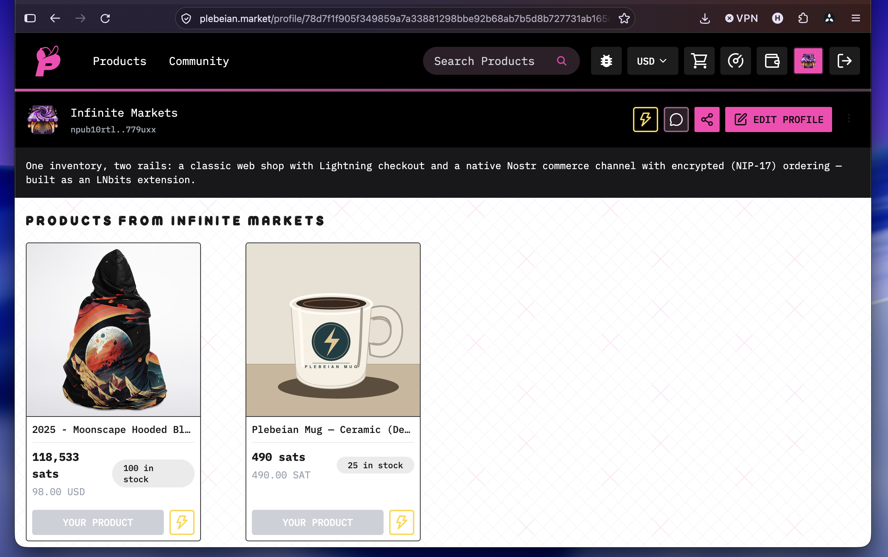

Note:
Other recorded deltas: Plebeian's live checkout sends a single recipient-only
wrap to its app relay (the strict transport resolves both kind-10050 lists);
public receipt events are invisible to the NIP-17 inbox. All six are kept in
the known-delta register in tests/conformance/README.md.

---

<!-- slide: layout=split accent=blue kicker="part 4 · conduit market" -->
# Conduit Market: same open spec

**About Conduit**
- Shopper marketplace + Merchant Portal on Nostr
- Gamma spec co-author; works with the Open Markets Foundation on a shared commerce spec (draft)
- Not the seller, custodian, carrier or escrow; merchants bring their own Lightning

**Fit with Infinite Markets** [spec-aligned] [todo]
- Same listing, collection & shipping kinds (30402 / 30405 / 30406)
- NIP-17 orders to the merchant inbox; merchant issues the invoice
- **To do:** add Conduit to the conformance matrix, as was done for Plebeian

Note:
Conduit interop is expected from shared Gamma kinds but has not been tested yet.

---

<!-- slide: layout=split accent=blue kicker="part 4 · lnbits merchant stack" -->
# Plugging into the LNbits Merchant Stack

**Today** [shipped]
- Payments via **LNbits core** (invoices, settlement, reconciliation)
- Email via host **SMTP notifications**
- Embeds via **WebPages**; reference inbox relay via **nostrrelay**
- Inventory & shipping are **native to Infinite Markets**

**Next** [roadmap]
- **Inventory** extension as a shared stock source across LNbits sales channels
- **Shipping** extension integration for shipping rules & fulfillment

Note:
Not implemented today: the extension doesn't read or write other LNbits
inventory or shipping extensions. Keep "one writer per catalog" as the guiding
rule when deciding which extension owns stock.

---

<!-- slide: layout=table accent=lime kicker="summary" -->
# Pain → solution

| Pain | Infinite Markets answer |
|---|---|
| Catalog copied per marketplace | One authoritative DB, published as open Nostr events |
| Overselling across channels | Atomic reservations shared by web & Nostr orders |
| "Was it paid?" | Only settled LNbits payments confirm orders |
| Duplicate / lost invoices | Saga + exact-id reconciliation, never a blind 2nd invoice |
| Browser-bound shops | Durable background workers inside LNbits |
| Unreliable relays | Outbox, per-relay ACK evidence, live catalog check |
| Metadata-leaking DMs | NIP-17 gift-wrapped orders |
| Platform lock-in | Merchant keeps key, stock, shipping, wallet, customers |

---

<!-- slide: layout=bullets accent=lime kicker="status & evidence" -->
# Where it stands

- **Releases A, B, 03.1 and C implemented**: web commerce, Gamma NIP-17 orders, buyer accounts, catalog import/export
- Published **v0.5** via LNbits extension manifest (sha256-verified)
- Conformance: gated `nostrrelay` env, egress / NIP-42 / paid-relay drills, **Plebeian matrix**, plus a live `plebeian.market` listing check
- Pinned host (LNbits `v1.6.2-rc1`), pinned Gamma spec & NIPs, recorded decisions
- Out of scope for v1: escrow, fiat custody, automated refunds, subscriptions, reviews

---

<!-- slide: layout=bullets accent=pink kicker="risks" -->
# Risks

1. **This is experimental software**: v0.5, built on a draft marketplace spec; start with small amounts
2. **Contingent on community support and feedback**: interop depends on marketplace clients, the spec working group, and real merchants using it
3. **Maintenance has a cost**: tracking LNbits releases, spec revisions, marketplace client changes, and security updates takes ongoing time and resources

---

<!-- slide: layout=bullets accent=lime kicker="what's next" -->
# What's next

- **Seeking testers and active users**: run the extension, validate it, send feedback, and file issues
- Run a **live checkout & order** on `plebeian.market`
- Add **Conduit Market** (and Shopstr) to the external-client matrix
- Structured-address interop so marketplace **physical orders** flow end to end
- LNbits **Inventory** and **Shipping** extension integration
- Track the **Open Markets Protocol** as the Gamma draft evolves

> Issues & feedback: github.com/bitkarrot/infinitemarkets/issues

---

<!-- slide: layout=cta accent=lime kicker="get started" -->
# One inventory. Every storefront. Your rails.

- Add the manifest in **LNbits → Server → Extensions → Manifest sources**:
  `https://raw.githubusercontent.com/bitkarrot/infinitemarkets/main/manifest.json`
- Set 4 host env vars: `INFINITEMARKETS_MASTER_KEYS`, `_ACTIVE_KEY_VERSION`, `_PRIVACY_KEY`, `_PUBLIC_BASE_URL`
- Bind a merchant wallet, then publish your first product

**Links**
- Source & issues: github.com/bitkarrot/infinitemarkets
- Architecture guide: infinitemarkets-docs.vercel.app
- Demo video (~3.5 min): `docs/assets/infinitemarkets_demo.mp4`

Infinite Markets · built on LNbits · MIT · by bitkarrot
