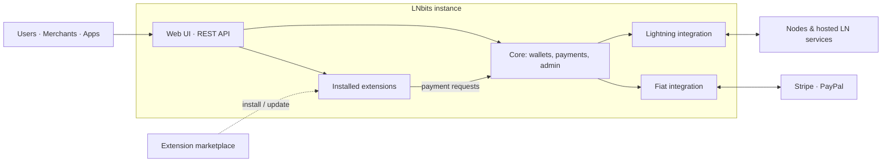
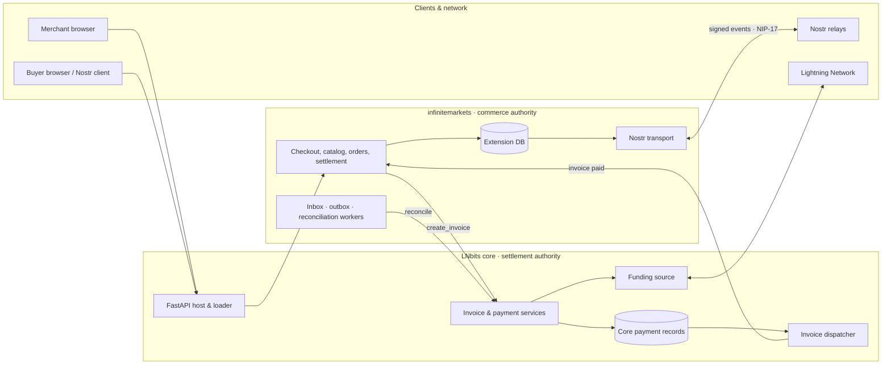
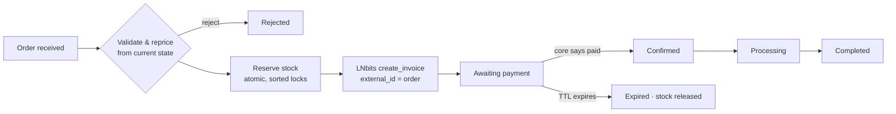
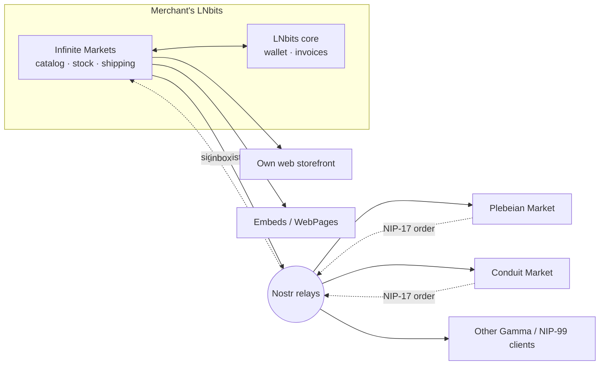

<!--
Deck source for the infinitemarkets slideshow (rendered later by slides.html
using docs/viewer/assets/style.css).

Authoring conventions
- Slides are separated by a line containing only `---`.
- The first line of a slide may carry a metadata comment:
    <!-- slide: layout=<title|section|bullets|split|diagram|table|quote|cta> accent=<lime|yellow|orange|pink|mint|blue> kicker="..." -->
  `accent` maps to the viewer palette tokens (--lime, --yellow, ...).
  `kicker` renders as the mono pill above the headline (like the index page).
- `Note:` starts speaker notes; everything after it on that slide is notes only.
- ```mermaid blocks render with the viewer's brutalist node styling.
- Status tags used in bullets: [shipped] [tested] [spec-aligned] [roadmap].
-->

<!-- slide: layout=title accent=lime kicker="infinitemarkets · v0.5 · LNbits extension" -->
# Infinite Markets

## One inventory. Every storefront. Your rails.

A Lightning-settled commerce engine for LNbits — sell on your own web shop
and on Nostr marketplaces like Plebeian Market and Conduit Market,
without giving up inventory, shipping, or payments.

Note:
Frame the talk in one sentence: the merchant keeps the shop's brain (catalog,
stock, shipping, invoices, customer messages) inside their own LNbits instance,
and every storefront, theirs or a marketplace's, is just a window onto it.

---

<!-- slide: layout=bullets accent=yellow kicker="agenda" -->
# What we'll cover

1. **LNbits backgrounder**: the wallet and extension platform underneath
2. **The pain**: why selling with Bitcoin on Nostr is hard today
3. **Infinite Markets**: what it is and how it works
4. **Publish everywhere**: Plebeian, Conduit & other Gamma marketplaces
5. **Own your rails**: inventory, shipping, payments stay with the merchant
6. **Status, evidence & roadmap**

---

<!-- slide: layout=section accent=orange kicker="part 1" -->
# LNbits backgrounder

The platform Infinite Markets is built on

---

<!-- slide: layout=bullets accent=orange kicker="lnbits · what it is" -->
# What is LNbits?

- **Free, open-source (MIT)** Lightning wallet & accounts system, in development since 2018
- Sits **on top of any Lightning funding source** and splits it into many isolated wallets
- **Clean REST API** for invoices, payments, and wallet management
- **Multi-user accounts** with role-based access: admin key, invoice key, custom ACLs
- **Extension platform**: install or build apps that add features on top of wallets
- Runs on a Raspberry Pi, a VPS, node platforms, or **hosted SaaS** (my.lnbits.com)

Note:
Key concept: LNbits is a layer of abstraction between users and the node. One
node serves many users; each wallet tracks its own balance and has its own keys;
switching the funding source doesn't touch user balances.

---

<!-- slide: layout=split accent=orange kicker="lnbits · how it works" -->
# One node, many wallets

**Concepts**

| Concept | Meaning |
|---|---|
| Account | Identity via email, username, or **Nostr pubkey** |
| Wallet | Virtual Lightning wallet with its own balance & keys |
| Admin key | Full access, can spend |
| Invoice key | Read + receive only |
| Extension | Plugin with its own API, UI, DB tables |
| Funding source | The backend that actually moves sats |

**Why it matters for merchants**

- One shop wallet per business line or channel
- Extensions get invoice creation **without holding spend keys**
- Swap backends without migrating balances

---

<!-- slide: layout=split accent=orange kicker="lnbits · funding sources" -->
# Bring your own backend

**Self-hosted nodes**
- LND (gRPC / REST), Core Lightning (RPC / CLNRest), Eclair, Phoenixd

**Hosted Lightning services**
- Alby, Strike, Blink, OpenNode, ZBD, LNPay, and more

**Advanced**
- Nostr Wallet Connect (NWC), Breez SDK, Spark L2, Boltz swaps

**Fiat providers**
- Stripe and PayPal integrations for card payments

Note:
A merchant can start on a hosted service or NWC and graduate to their own node
later. Nothing in Infinite Markets changes when they do: it only ever asks
LNbits core to create an invoice on the merchant's bound wallet.

---

<!-- slide: layout=bullets accent=orange kicker="lnbits · extensions" -->
# An extension platform, not just a wallet

- Python extensions are first-class apps: **own routes, DB migrations, UI, start/stop hooks**
- **Permanent background tasks**: work keeps running while the merchant's browser is closed
- Payment events dispatched to extensions via core's **invoice listener**
- Installed from **manifest sources** with sha256-verified release archives
- Ecosystem: POS, paywalls, tickets, LNURL, Nostr relay/client, WebPages, and more

---

<!-- slide: layout=diagram accent=orange kicker="lnbits · architecture" -->
# LNbits at a glance



Note:
Source: docs/lnbits_architecture_overview.md (conceptual, not a payment-flow diagram).

---

<!-- slide: layout=table accent=orange kicker="lnbits · merchant stack" -->
# The LNbits Merchant Stack

| Piece | Role |
|---|---|
| **TPoS** | In-person checkout |
| **Inventory** | Shared products & stock across extensions |
| **Orders** | Receipts, order history, notifications, shipping status |
| **WebShop** | Simple online sales |
| **Tabs** | Open balances, deferred settlement |
| **SaaS** | Hosted LNbits instance, no server to run |

> Infinite Markets adds the missing piece: **Nostr-native, multi-marketplace
> commerce** with a production-grade checkout.

---

<!-- slide: layout=section accent=pink kicker="part 2" -->
# The pain points

Why selling with Bitcoin on Nostr is still hard

---

<!-- slide: layout=bullets accent=pink kicker="pain · fragmentation" -->
# 1 · Every storefront wants its own catalog

- Web shop, Plebeian, Conduit, Shopstr… each one becomes **another copy of the catalog**
- Stock counts drift between channels, so the merchant **oversells** or under-lists
- Price, shipping, and visibility edits have to be repeated everywhere
- Hosted marketplaces can own the **customer relationship** and sometimes the funds

---

<!-- slide: layout=bullets accent=pink kicker="pain · payments" -->
# 2 · "Was this actually paid?"

- On Nostr, a receipt message or a relay event **is not proof of payment**
- Buyer-supplied amounts can't be trusted
- Duplicate invoices from retries or crashes lead to double charges or orphaned payments
- Payments that land after expiry or cancellation get silently lost or mis-applied

---

<!-- slide: layout=bullets accent=pink kicker="pain · operations" -->
# 3 · Shops that only work while a tab is open

- Many Nostr commerce clients need the **merchant's browser/signer online** to answer orders and issue invoices
- Relays are unreliable: publish ≠ delivered, and nothing records **which relay accepted what**
- Deleted products keep showing up on relays that ignore deletions
- Order DMs over NIP-04 leak **who is buying from whom**

---

<!-- slide: layout=table accent=pink kicker="pain · protocol" -->
# 4 · The protocol ground moved

| | NIP-15 (legacy `nostrmarket`) | NIP-99 + Gamma spec |
|---|---|---|
| Status | Draft, **unrecommended** | Ecosystem direction |
| Grouping | Stall-centric | Independent collections (30405) |
| Shipping | Embedded in stall | Addressable options (30406) |
| Variants | None | Variable / variation products |
| Private messages | NIP-04 (leaks metadata) | NIP-17 gift-wrapped (NIP-44/59) |
| Order state | `paid` / `shipped` booleans | Full status & shipping lifecycle |
| Inventory | Decrement after payment, no reservation | Reservation → invoice → settle |

Note:
NIP-99 alone defines only the listing. The Gamma Markets spec (authored by
the Shopstr, Cypher, Plebeian Market and Conduit teams) adds the commerce
layer: collections, shipping, NIP-17 orders, payment requests, receipts.

---

<!-- slide: layout=section accent=mint kicker="part 3" -->
# Infinite Markets

One inventory, two rails

---

<!-- slide: layout=bullets accent=mint kicker="infinite markets · what it is" -->
# What it is

- A **standard Python LNbits extension** (`infinitemarkets`), MIT, v0.5, LNbits ≥ 1.6.0
- **Commerce authority**: catalog, inventory, shipping, orders, messages, publication
- **LNbits core stays the settlement authority**: invoices, payment records, funding source
- Rail 1: a **classic web storefront** with Lightning checkout
- Rail 2: a **native Nostr/Gamma channel** with NIP-17 encrypted ordering
- Both rails share **one pricing, reservation, invoice & settlement pipeline**

> No duplicate invoices. No double allocation. Relay delivery is never mistaken for payment truth.

---

<!-- slide: layout=bullets accent=mint kicker="infinite markets · principles" -->
# Five design principles

1. **Domain before protocol**: products & orders are commerce records; Nostr events are projections of them
2. **Exactly one writer per catalog**: one extension owns stock and invoice creation
3. **Payment truth comes from LNbits**: only settled core payments confirm orders
4. **Relays are eventually consistent transport**: outbox, ACK evidence, retries
5. **Compatibility is testable**: proven against real clients, not just matching kind numbers

---

<!-- slide: layout=diagram accent=mint kicker="infinite markets · architecture" -->
# Who owns what



Note:
Full version with numbered flow: viewer diagram 01 (lnbits-integration).
The extension never writes core payment tables and never calls outgoing-payment APIs.

---

<!-- slide: layout=split accent=mint kicker="rail 1 · web" -->
# Rail 1: the web storefront

**For shoppers**
- Category & collection browsing, price filters, sorting
- Lightning checkout with private per-order links
- Sign in with Nostr (NIP-07) or **email magic link**, unified order history
- Dark/light toggle, mobile-first layouts

**For merchants**
- Theme presets, 4 layouts, brand logo/hero/footer
- Point-and-click Fine-tune with **WCAG contrast gates**
- Email notifications for order events

---

<!-- slide: layout=table accent=mint kicker="rail 2 · nostr" -->
# Rail 2: native Nostr commerce

| Kind | Published / handled | Purpose |
|---|---|---|
| `30402` | out | NIP-99 product listing (price, stock, images, specs) |
| `30405` | out | Collection |
| `30406` | out | Shipping option |
| `0` | out | Merchant profile (name, bio, NIP-05, lud16) |
| `10050` | out | Inbox relays (where to send orders) |
| `31989/31990` | out | NIP-89 handler: deep-link to merchant pages |
| `1059` | in & out | NIP-17 gift-wrapped orders, payment requests, status |
| `5` | out | Deletion / tombstone |

Note:
Optional NIP-15 projection (30017/30018) exists per category for legacy clients.
Orders, invoices, and buyer data are never exposed publicly.

---

<!-- slide: layout=diagram accent=mint kicker="checkout saga" -->
# Quote → reserve → invoice → settle



- Reservation hold defaults to **15 min**; stock is consumed exactly once on settlement
- Uncertain invoice creation is **never retried blindly**; reconciliation queries core by exact id
- Late payments are flagged for an explicit merchant decision, never auto-reopened

---

<!-- slide: layout=bullets accent=mint kicker="durable delivery" -->
# Relays you can audit

- Every catalog change becomes a **durable outbox intent**
- Worker rebuilds the event from **current** state, signs it, sends it, and records **per-relay ACK/reject/timeout**
- **Publications** tab shows the evidence; zero ACKs mean retry with backoff
- **Relay catalog check** verifies live relay copies: missing / divergent / stale-deleted
- One click **re-requests deletions** for stale copies (fresh kind-5)

---

<!-- slide: layout=split accent=mint kicker="merchant operations" -->
# A real back office

**Admin workspaces**
- Orders: split list/detail with full chronology
- Catalog: sortable products, drafts, preview
- Publications: relay evidence & catalog check
- Messages: encrypted customer threads with verified profiles
- Appearance & Embed

**Background workers**
- Outbox publisher (5 s), relay manager (30 s)
- Reservation expiry (30 s), reconciliation (60 s)
- Email sender (5 s), retention pruner (24 h)

---

<!-- slide: layout=table accent=mint kicker="storefront modes" -->
# Choose how you sell

| Mode | Web browse | Web checkout | Nostr listings | Nostr orders |
|---|---|---|---|---|
| `full` (default) | ✓ | ✓ | ✓ | ✓ |
| `showcase` | ✓ | guided "Order via Nostr" | ✓ | ✓ |
| `browse_only` | ✓ | — | paused | — |
| `nostr_only` | notice only | — | ✓ | ✓ |

Private order links and in-flight invoices keep working in **every** mode.

---

<!-- slide: layout=split accent=mint kicker="embed & import" -->
# Meet merchants where they are

**Embed anywhere**
- `gm-embed.js` drops product cards into any page (no iframe)
- Modal mode, or a chrome-free iframe with auto-height
- Works with the LNbits **WebPages** extension

**Bring your catalog**
- Shopify CSV, native CSV, `nostrmarket` JSON, signed NIP-15 dumps
- Imports land as **hidden drafts** for review, then publish normally
- Round-trippable CSV export, media relink

---

<!-- slide: layout=bullets accent=mint kicker="security & privacy" -->
# Secure by construction

- **Never spends**: no outgoing-payment API calls; paid-relay invoices surfaced, not paid
- Merchant `nsec`, buyer identifiers, NIP-17 payloads, profiles **encrypted at rest**
- Owner-only, explicit private-key reveal/export
- Relay egress screening blocks private / loopback / metadata IP ranges
- NIP-42 relay auth, backoff on churn, per-IP checkout rate limits
- Order tokens live in the URL fragment, never in paths or queries

---

<!-- slide: layout=section accent=blue kicker="part 4" -->
# Publish everywhere, own your rails

Marketplaces become storefronts, not landlords

---

<!-- slide: layout=bullets accent=blue kicker="the big idea" -->
# Publish once, appear everywhere

- Infinite Markets signs **standard NIP-99 / Gamma events** with the merchant's key
- Any Gamma-compatible marketplace reading those relays **shows the listings**: Plebeian Market, Conduit Market, Shopstr and others
- Buyers check out **in the marketplace they already use**
- The order arrives as a **NIP-17 message in the merchant's own inbox**
- From there it enters the **same reservation & invoice pipeline** as a web order

> The marketplace is a view. The merchant's LNbits is the source of truth.

---

<!-- slide: layout=diagram accent=blue kicker="one inventory, many storefronts" -->
# One inventory, many storefronts



---

<!-- slide: layout=table accent=blue kicker="what stays yours" -->
# What never leaves the merchant

| Rail | Where it lives | Why it matters |
|---|---|---|
| **Inventory** | Extension DB: on-hand + reserved, per product/variant | One stock count across every channel, no oversell |
| **Shipping** | Merchant-defined options, country zones, weight/volume rules, published as 30406 | Marketplaces quote the merchant's rules, not their own |
| **Payments** | LNbits wallet on the merchant's chosen funding source | Self-custody option, no marketplace custody, no fees in the middle |
| **Customers** | Encrypted NIP-17 threads + email in the merchant's admin | Relationship isn't owned by a platform |
| **Identity** | Merchant Nostr key, encrypted at rest | Portable across every Nostr app |

Note:
Kind-0 advertises payment_preference=manual, so Gamma clients wait for the
merchant's own payment request. The marketplace never generates the invoice;
the merchant's LNbits does, bound to the order.

---

<!-- slide: layout=bullets accent=blue kicker="walkthrough" -->
# A marketplace order, end to end

1. Buyer finds the product on **Plebeian / Conduit** (kind 30402 from relays)
2. Marketplace sends a **gift-wrapped order** to the merchant's kind-10050 inbox relays
3. Infinite Markets verifies, deduplicates, and **reprices from current state**
4. Stock is **reserved**; LNbits creates an **order-bound invoice**
5. A **payment request** (type 2) goes back to the buyer over NIP-17
6. LNbits reports settlement, the order is **confirmed**, and status updates (type 3) follow
7. The merchant fulfills from the **same Orders workspace** used for web orders

---

<!-- slide: layout=split accent=blue kicker="plebeian market" -->
# Plebeian Market: proven interop

**What's tested** [tested]
- Scripted matrix against a **pinned `PlebeianApp/market` clone**: 14/14 probes pass
- Real checkout path → NIP-17 intake → invoice → settlement → confirmed
- Strict dual-copy transport and buyer read-back verified

**Known deltas (recorded, not hidden)**
- Physical orders with opaque free-text addresses are **rejected before reservation**, with a clear reply
- Live checkout sends a recipient-only wrap to the app relay
- Live `plebeian.market` public smoke: **manual gate, pending**

---

<!-- slide: layout=split accent=blue kicker="conduit market" -->
# Conduit Market: same open spec

**About Conduit**
- Shopper marketplace + Merchant Portal on Nostr
- Gamma spec co-author; works with the Open Markets Foundation on a shared commerce spec (draft)
- Not the seller, custodian, carrier or escrow; merchants bring their own Lightning

**Fit with Infinite Markets** [spec-aligned]
- Same listing, collection & shipping kinds (30402 / 30405 / 30406)
- NIP-17 orders to the merchant inbox; merchant issues the invoice
- **Next step:** add Conduit to the conformance matrix, as was done for Plebeian

Note:
Be precise: Conduit interop is expected from shared Gamma kinds but has not
been exercised by the repo's conformance suite yet. Plebeian has.

---

<!-- slide: layout=bullets accent=blue kicker="nip-89" -->
# Marketplaces can hand off to the merchant

- Merchant publishes a **NIP-89 handler** (31990) and recommendation (31989)
- Clients can deep-link `naddr` products straight to **the merchant's own product page & checkout**
- `showcase` mode adds a guided **"Order via Nostr"** for web visitors
- Result: discovery happens anywhere; checkout can happen on the merchant's terms

---

<!-- slide: layout=split accent=blue kicker="lnbits merchant stack · roadmap" -->
# Plugging into the LNbits Merchant Stack

**Today** [shipped]
- Payments via **LNbits core** (invoices, settlement, reconciliation)
- Email via host **SMTP notifications**
- Embeds via **WebPages**; reference inbox relay via **nostrrelay**
- Inventory & shipping are **native to Infinite Markets**

**Next** [roadmap]
- **Inventory** extension as a shared stock source with TPoS / WebShop
- **Orders** extension for receipts, labels, and staff notifications
- **TPoS** in-person sales drawing from the same stock

Note:
Not implemented today: the extension doesn't read or write the Inventory or
Orders extensions. This slide is the integration vision; keep "one writer per
catalog" as the guiding rule when deciding which extension owns stock.

---

<!-- slide: layout=table accent=lime kicker="summary" -->
# Pain → solution

| Pain | Infinite Markets answer |
|---|---|
| Catalog copied per marketplace | One authoritative DB, published as open Nostr events |
| Overselling across channels | Atomic reservations shared by web & Nostr orders |
| "Was it paid?" | Only settled LNbits payments confirm orders |
| Duplicate / lost invoices | Saga + exact-id reconciliation, never a blind 2nd invoice |
| Shop needs an open browser | Durable background workers inside LNbits |
| Unreliable relays | Outbox, per-relay ACK evidence, live catalog check |
| Metadata-leaking DMs | NIP-17 gift-wrapped orders |
| Platform lock-in | Merchant keeps key, stock, shipping, wallet, customers |

---

<!-- slide: layout=bullets accent=lime kicker="status & evidence" -->
# Where it stands

- **Releases A, B, 03.1 and C implemented**: web commerce, Gamma NIP-17 orders, buyer accounts, catalog import/export
- Published **v0.5** via LNbits extension manifest (sha256-verified)
- Conformance suite: gated `nostrrelay` env, egress/NIP-42/paid-relay drills, **Plebeian matrix**
- Pinned host (LNbits `v1.6.2-rc1`), pinned Gamma spec & NIPs, recorded decisions
- Out of scope for v1: escrow, fiat custody, automated refunds, subscriptions, reviews

---

<!-- slide: layout=bullets accent=lime kicker="roadmap" -->
# What's next

- Close the **live `plebeian.market`** public-relay smoke
- Add **Conduit Market** (and Shopstr) to the external-client matrix
- Structured-address interop so marketplace **physical orders** flow end to end
- LNbits **Merchant Stack** integration: Inventory, Orders, TPoS
- Track the **Open Markets Protocol** as the Gamma draft evolves

---

<!-- slide: layout=cta accent=lime kicker="get started" -->
# Try it

- Add the manifest in **LNbits → Server → Extensions → Manifest sources**:
  `https://raw.githubusercontent.com/bitkarrot/infinitemarkets/main/manifest.json`
- Set 4 host env vars: `INFINITEMARKETS_MASTER_KEYS`, `_ACTIVE_KEY_VERSION`, `_PRIVACY_KEY`, `_PUBLIC_BASE_URL`
- Bind a merchant wallet, then publish your first product

**Links**
- Source: github.com/bitkarrot/infinitemarkets
- Architecture guide: infinitemarkets-docs.vercel.app
- Demo video (~3.5 min): `docs/assets/infinitemarkets_demo.mp4`

---

<!-- slide: layout=title accent=pink kicker="thank you" -->
# One inventory. Every storefront. Your rails.

Infinite Markets · built on LNbits · MIT · by bitkarrot
